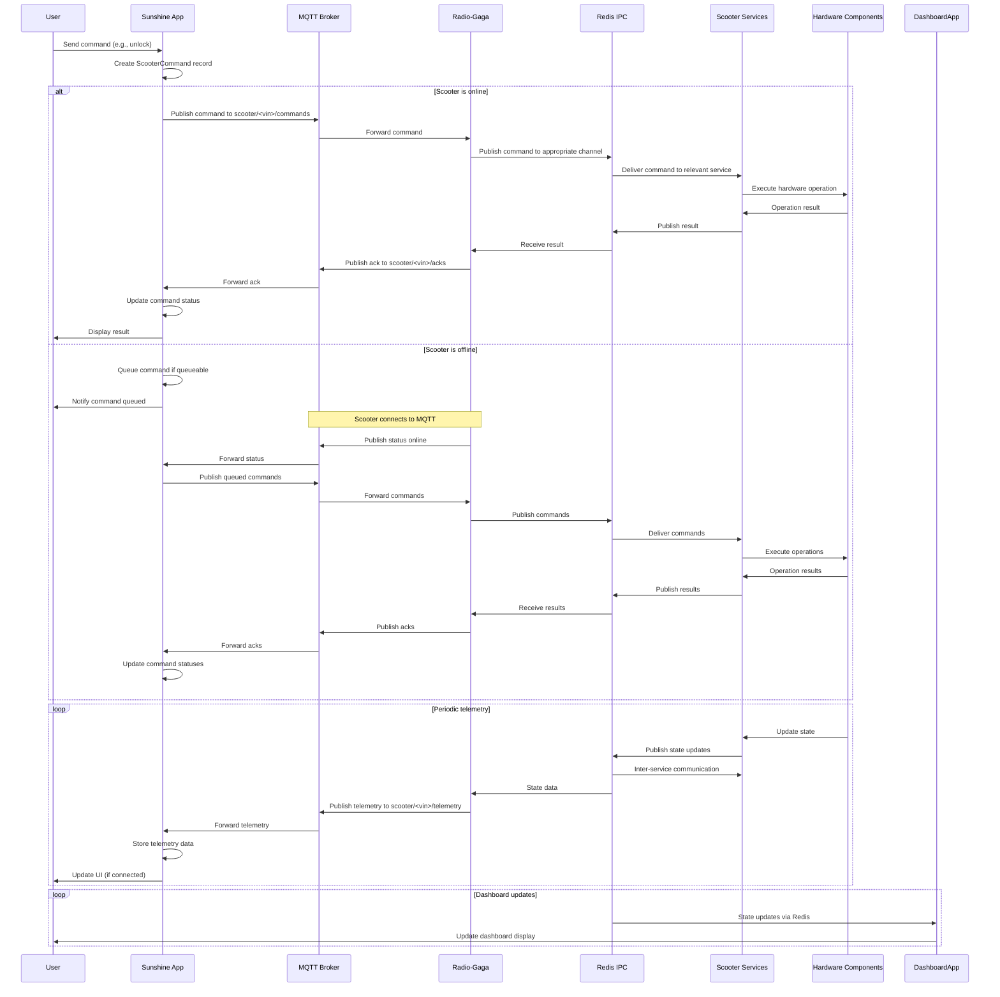
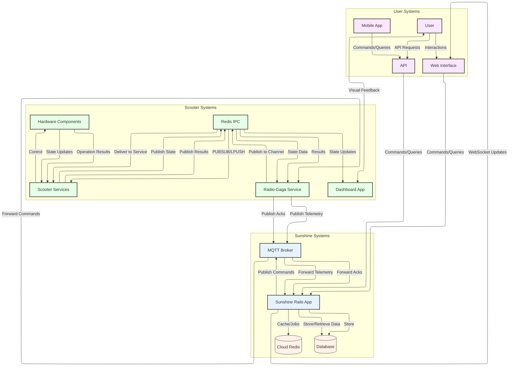
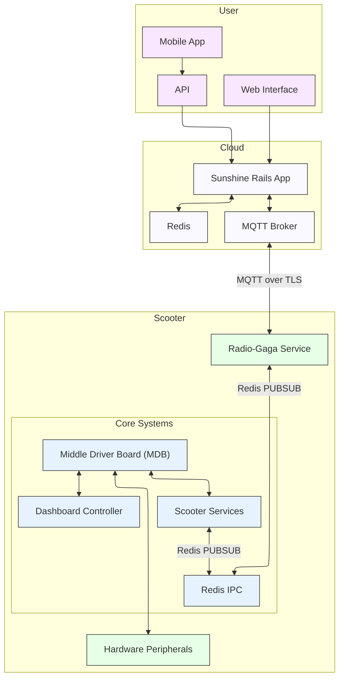
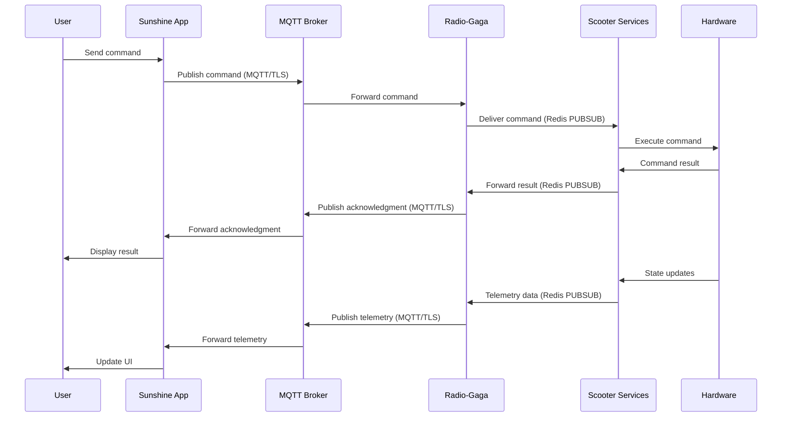

# System Architecture Diagrams

```mermaid
---
config:
  layout: elk
---
graph TB
    %% Define main components
    subgraph "Cloud Infrastructure"
        Sunshine["Sunshine Rails App"]
        CloudRedis["Redis (Caching, Jobs, Real-time)"]
        MQTT["MQTT Broker (Mosquitto)"]
    end
    
    subgraph "Scooter"
        RadioGaga["Radio-Gaga Service"]
        
        subgraph "Core Electronics"
            MDB["Middle Driver Board (MDB)"]
            
            subgraph "MDB Services"
                BatteryService["unu-battery.service"]
                BluetoothService["unu-bluetooth.service"]
                ECUService["unu-engine-ecu.service"]
                ModemService["unu-modem.service"]
                NetConfigService["unu-netconfig.service"]
                NRFUpdateService["unu-nrf-update.service"]
                PowerMgmtService["unu-pm.service"]
                SAMService["unu-sam.service"]
                UplinkService["unu-uplink.service"]
                VehicleService["unu-vehicle.service"]
                KeycardService["unu-keycard.service"]
            end
            
            ScooterRedis["Redis IPC (192.168.7.1:6379)"]
            
            subgraph "Hardware Interfaces"
                GPIO["GPIO Interfaces"]
                I2C["I2C Bus"]
                SPI["SPI Bus"]
                UART["UART/Serial"]
                NRF52["BMD340/nRF52 Chip"]
            end
            
            DBC["Dashboard Controller (DBC)"]
            DashboardApp["Dashboard App"]
            NFCReader["NFC Reader (Keycard Auth)"]
            
            ECU["Electronic Control Unit (ECU)"]
        end
        
        subgraph "Power Systems"
            MainBattery["Main Battery System"]
            AuxBattery["Auxiliary Battery (12V)"]
            CBB["Connectivity Box Battery"]
        end
        
        subgraph "Peripherals"
            Motor["Motor"]
            Lights["Lights System"]
            Horn["Horn"]
            Locks["Locks (Handlebar/Seatbox)"]
            Sensors["Various Sensors"]
        end
    end
    
    subgraph "User Interfaces"
        WebUI["Web Interface"]
        MobileApp["Mobile App"]
        API["API"]
    end
    
    %% Define connections
    WebUI --> Sunshine
    MobileApp --> API
    API --> Sunshine
    
    Sunshine <--> CloudRedis
    Sunshine <--> MQTT
    
    MQTT <--> RadioGaga
    
    RadioGaga <--> ScooterRedis
    
    %% MDB Services connections
    BatteryService <--> ScooterRedis
    BluetoothService <--> ScooterRedis
    ECUService <--> ScooterRedis
    ModemService <--> ScooterRedis
    NetConfigService <--> ScooterRedis
    NRFUpdateService <--> ScooterRedis
    PowerMgmtService <--> ScooterRedis
    SAMService <--> ScooterRedis
    UplinkService <--> ScooterRedis
    VehicleService <--> ScooterRedis
    KeycardService <--> ScooterRedis
    
    %% Hardware connections
    BatteryService <--> MainBattery
    ECUService <--> ECU
    BluetoothService <--> NRF52
    PowerMgmtService <--> NRF52
    KeycardService <--> NFCReader
    
    %% Dashboard connections
    DBC <--> MDB
    DBC <--> DashboardApp
    DashboardApp <--> ScooterRedis
    DBC <--> NFCReader
    
    %% Hardware interface connections
    MDB <--> GPIO
    MDB <--> I2C
    MDB <--> SPI
    MDB <--> UART
    MDB <--> NRF52
    
    %% Peripheral connections
    ECU <--> Motor
    GPIO <--> Lights
    GPIO <--> Horn
    GPIO <--> Locks
    GPIO <--> Sensors
    
    %% Power connections
    MDB <--> MainBattery
    MDB <--> AuxBattery
    MDB <--> CBB
    
    %% Define styles
    classDef cloud fill:#f9f9ff,stroke:#333,stroke-width:1px;
    classDef scooter fill:#e6ffe6,stroke:#333,stroke-width:1px;
    classDef electronics fill:#e6f3ff,stroke:#333,stroke-width:1px;
    classDef services fill:#ffe6e6,stroke:#333,stroke-width:1px;
    classDef hardware fill:#e6ffff,stroke:#333,stroke-width:1px;
    classDef power fill:#fff2e6,stroke:#333,stroke-width:1px;
    classDef peripherals fill:#f2e6ff,stroke:#333,stroke-width:1px;
    classDef ui fill:#f9e6ff,stroke:#333,stroke-width:1px;
    
    class Sunshine,CloudRedis,MQTT cloud;
    class RadioGaga scooter;
    class MDB,DBC,ECU,ScooterRedis electronics;
    class BatteryService,BluetoothService,ECUService,ModemService,NetConfigService,NRFUpdateService,PowerMgmtService,SAMService,UplinkService,VehicleService,KeycardService services;
    class GPIO,I2C,SPI,UART,NRF52,NFCReader,DashboardApp hardware;
    class MainBattery,AuxBattery,CBB power;
    class Motor,Lights,Horn,Locks,Sensors peripherals;
    class WebUI,MobileApp,API ui;
```

## Communication Flow Diagram

## Data Flow Diagram

## Simplified Architecture Diagram

## Simplified Communication Flow

## Component Details

### Cloud Infrastructure
- **Sunshine**: Rails application for managing scooters, processing telemetry, tracking trips, and controlling scooter functionality
- **Redis**: Used for caching, background jobs, and real-time updates in Sunshine
- **MQTT Broker**: Mosquitto MQTT broker with authentication for secure communication between Sunshine and scooters

### Scooter Components

#### Radio-Gaga
- Service running on the scooter that handles communication with the cloud via MQTT
- Bridges between MQTT and the scooter's internal Redis IPC system

#### Middle Driver Board (MDB)
- Central control system that manages power distribution and system communications
- Connected to various hardware peripherals via GPIO, I2C, SPI, and UART interfaces
- Houses the BMD340/nRF52 chip that manages power states and Bluetooth communications
- Runs multiple services that control different aspects of the scooter

#### MDB Services
- **battery service**: Manages battery communication and monitoring
- **bluetooth service**: Handles Bluetooth connectivity via the nRF52 chip
- **engine-ecu service**: Interfaces with the motor controller
- **modem service**: Manages cellular connectivity
- **nrf-update service**: Handles firmware updates for the nRF52 chip
- **pm service**: Power management service
- **sam service**: System access management
- **uplink service**: Manages cloud connectivity (unu telemetry)
- **vehicle service**: Controls vehicle state and peripherals
- **keycard service**: Handles RFID keycard authentication

#### Dashboard Controller (DBC)
- Manages display and user interface
- Runs a dashboard application that gets its state from Redis on the MDB
- Includes NFC reader for keycard authentication

#### Redis IPC
- Internal communication system on the scooter (runs on 192.168.7.1:6379)
- Services communicate with each other through Redis PUBSUB, LPUSH, etc.
- Central hub for state management and inter-process communication

#### Hardware Interfaces
- **GPIO**: General-purpose input/output for controlling various peripherals
- **I2C**: Inter-integrated circuit bus for sensor communication
- **SPI**: Serial peripheral interface for high-speed communication
- **UART**: Universal asynchronous receiver-transmitter for serial communication
- **nRF52**: Bluetooth and power management chip

#### Peripherals
- **Motor**: Electric motor controlled by the ECU
- **Lights**: Lighting system controlled via GPIO
- **Horn**: Horn controlled via GPIO
- **Locks**: Handlebar and seatbox locks controlled via GPIO
- **Sensors**: Various sensors for monitoring scooter state

### Communication Protocols
- **MQTT**: Used for communication between Sunshine and Radio-Gaga
- **Redis PUBSUB/LPUSH**: Used for internal communication between services on the scooter
- **WebSockets**: Used for real-time updates in the web interface
- **HTTP/JSON**: Used for API communication
- **Bluetooth LE**: Used for local device connectivity
- **CAN Bus**: Used for communication with the ECU

### Data Flows
1. **Commands**: Sunshine → MQTT → Radio-Gaga → Redis IPC → Services → Hardware
2. **Telemetry**: Hardware → Services → Redis IPC → Radio-Gaga → MQTT → Sunshine
3. **Acknowledgments**: Hardware → Services → Redis IPC → Radio-Gaga → MQTT → Sunshine
4. **Dashboard Updates**: Redis IPC → Dashboard App → User Interface
5. **Inter-service Communication**: Services ↔ Redis IPC ↔ Services
